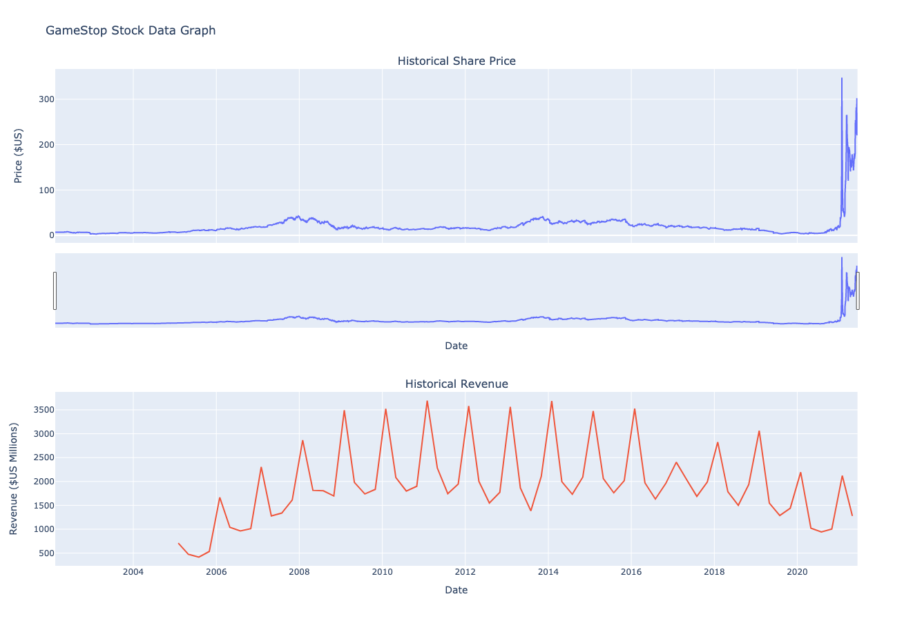
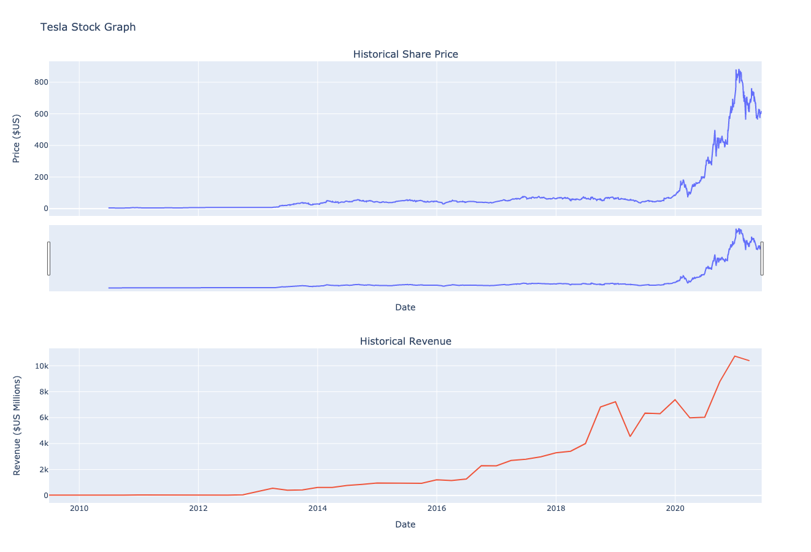

# Extracting and Visualizing Stock Data
This is a python project for data science. On this project, I'm going to extract some stock data using Webscraping and then present it in a graph.

## Install Requirements
```bash
$ pip install -r requirement.txt

```




